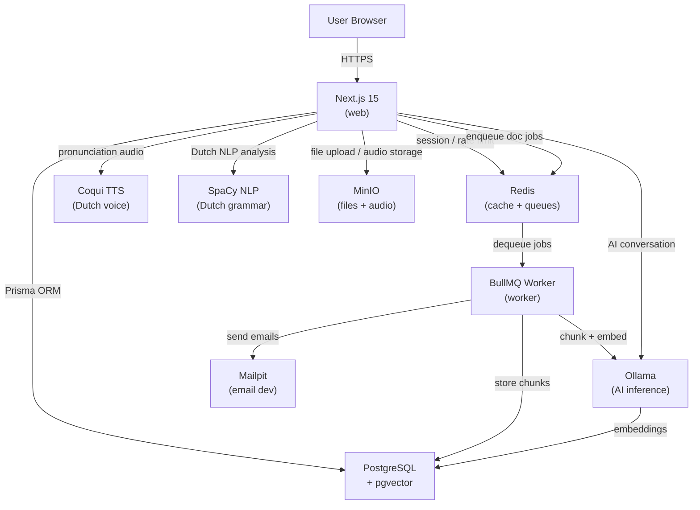

# Dutch AI Language Learning System

## The Core Idea: "Dutch DNA"

Unlike Duolingo's fixed tree, this app builds a live **weakness map** per user — a dynamic knowledge graph across every dimension of Dutch (phonetics, grammar, vocabulary, conversation). Every interaction updates this map. The system never shows you what you already know; it targets your exact gaps.

## What Makes This Different

- **No fixed curriculum** — the AI generates content on-the-fly based on your weakness map
- **Mistake-driven engine** — you write/speak Dutch freely, the AI catches mistakes and fires back targeted micro-lessons
- **Phonetic studio** — Dutch has brutal sounds (`g`, `ui`, `ij`, `sch`); real-time browser waveform feedback
- **Roleplay scenarios** — full conversations with an AI playing a Dutch person (baker, colleague, landlord), with inline error correction that doesn't break the flow
- **Contextual stories** — micro-stories generated around your weak vocabulary, not word lists
- **De/Het oracle** — a dedicated sub-system for the hardest Dutch rule, backed by a full noun-gender database
- **Personal document library** — upload your own PDFs, text files, or images; the AI teaches from your own content (RAG)
- **Goal-based learning paths** — the system adapts completely based on why you're learning: inburgering, work, family, travel, or academic
- **Native language interference model** — your native language pre-configures the weakness map (Turkish speaker ≠ German speaker)
- **Separable verb trainer** — Dutch's most uniquely hard grammar point: "opbellen → Ik bel je op"
- **Word order puzzle** — drag-and-drop V2 rule and subordinate clause games
- **Correction style choice** — immersive recasting, guided hints, or explicit rules; user decides
- **Pattern alert system** — when you make the same mistake 3+ times, a focused mini-lesson fires automatically

---

## Pedagogical Foundation (Dutch Teacher’s Perspective)

### Learning Goal Paths
The entire content focus adapts based on the user’s declared goal:

| Goal | Curriculum emphasis |
|---|---|
| **Inburgering** | NT2 A2 alignment, civic vocabulary, Dutch society/culture, exam prep |
| **Work in NL** | Formal register, business email, meeting language, phone Dutch |
| **Partner/family** | Informal register, emotions, casual conversation, gezelligheid |
| **Academic** | Formal written Dutch, complex subordinate clauses, academic vocabulary |
| **Travel** | Survival Dutch, ordering, directions, hospitality vocabulary |

### Native Language Pre-Configuration
On signup, native language selection pre-weights the weakness map based on known interference patterns:

| Native language | Pre-weakened axes |
|---|---|
| English | De/Het (low), Separable Verbs (low), Phonetics g/ui/ij (low) |
| German | False-Friends vocabulary (low), slight Phonetics adjustment |
| Turkish | Word Order (very low), De/Het (very low) |
| Arabic | Word Order (very low), Verb Conjugation (low) |
| French/Spanish | Phonetics (low), Word Order (medium) |

### Error Correction Styles (user chooses)
1. **Immersive (recasting)** — AI silently uses the correct form and moves on; natural acquisition
2. **Guided** — AI highlights the error at end of turn with the grammar rule
3. **Explicit** — AI pauses the conversation, fully explains, and runs a micro-drill

### Comprehensible Input (i+1)
The story engine tracks the % of words in each generated text that the user already knows. Target: ~85% known words. If a generated text falls below 75% known, it regenerates with simpler vocabulary. This implements Krashen’s input hypothesis automatically.

### Deep Onboarding Questionnaire
Beyond the CEFR placement test, the app runs a teacher-style intake:
1. What is your native language?
2. Why are you learning Dutch? (goal path selector)
3. What is your daily Dutch exposure? (live in NL / online only / none)
4. How much time per day? (10 min / 30 min / 1 hour)
5. Are you preparing for a specific exam? (NT2, Inburgering, CNaVT)
6. Which domain matters most? (work / family / daily life / academic)
7. What is your biggest Dutch frustration so far? (free text — AI parses for initial weakness hints)

Answers configure: goal path, native-language weakness pre-weights, session length, content domain, and correction style default.

---

## Intelligence Architecture

### Algorithm Layer
- **FSRS** (Free Spaced Repetition Scheduler) replaces basic SM-2; models per-card *difficulty*, *stability*, *retrievability*, and *elapsed days* per user; open-source TypeScript implementation (`ts-fsrs`)
- **Bayesian Knowledge Tracing (BKT)** replaces raw score arithmetic for weakness map updates; models knowledge as a true probability accounting for slips (know it but answered wrong) and guesses (don’t know it but answered right)
- **i+1 calibration loop**: after every AI-generated story, measure % of known vocabulary; if outside 75–85% window, regenerate with adjusted seed difficulty

### Behavioral Intelligence
- **Response time tracking**: `responseTimeMs` stored on every answer; hesitation on a correct answer flags item for more practice despite being correct
- **Frustration detection**: accuracy < 60% for 3+ consecutive items → silently lower difficulty, switch to a strength area to rebuild confidence
- **Boredom detection**: accuracy > 90% AND response time < 2s for 5+ items → increase difficulty, introduce new sub-axis
- **Session abandonment**: session < 3 min → next open shows a "quick win" 5-minute session
- **Time-of-day profile**: track accuracy by hour-of-day; surface insight after 2 weeks: "Your grammar accuracy is 23% higher at 9am than 9pm"
- **Input/output imbalance**: if >80% time in consuming modes (reading/listening) over past week, coaching nudge to add output practice

### Session Memory (Cross-Session AI Context)
- After every session, generate a structured summary: mistakes made, topics covered, vocabulary encountered, confidence signals
- Embed the summary with `nomic-embed-text` and store in `SessionMemory` table
- On new session start: retrieve top-3 most relevant past summaries via pgvector cosine search
- Inject retrieved memories into Ollama system prompt — the AI now says "Last week you had trouble with opbellen — I noticed you used it correctly just now, well done"

### Mistake Fingerprinting — Root Cause Analysis
Every mistake is tagged with a root cause beyond just its category:

| Root Cause | Meaning | Remedy |
|---|---|---|
| `INTERFERENCE` | Native language pattern bled through | Contrastive explanation: Dutch does X, your language does Y |
| `UNKNOWN` | Concept genuinely not encountered before | Teach from scratch, add to SRS |
| `CONFUSION` | Knows the rule but applied it to an exception | Teach the exception specifically |
| `CARELESS` | Only makes this mistake when response time is fast | Add a "double-check" prompt before submit |

Root cause stored on every `Mistake` record; drives which remediation template the AI uses.

### Proactive Diagnostic Probing
- After onboarding, system runs 5 targeted "probe" exercises in the highest-risk areas (based on native language model) BEFORE the user makes real mistakes
- "Before we start, let me quickly check a couple of things…"
- Probe results confirm or override the native-language pre-weights immediately
- Re-probing triggered after 2 weeks if a sub-axis score hasn’t moved (possible stagnation or mastery plateau)

### Dutch Knowledge Graph
- **Vocabulary family graph**: morphological clusters stored as an adjacency list; learning `werken` partially unlocks `werk`, `werkgever`, `werknemer`, `werkloosheid`, `overwerken` — user doesn’t re-discover connections from scratch
- **Grammar dependency graph**: skill tree of prerequisites; separable verbs must be solid before the system introduces perfect tense with separable verbs; visualized as a small skill tree on the dashboard
- Graph stored in PostgreSQL adjacency table, traversed at content-generation time

### Self-Improving Content Loop
- Every AI-generated exercise has a tracked outcome: too easy / well-calibrated / too hard (based on first-attempt accuracy + response time)
- Outcome feeds back into the content generation parameters for that user’s next session
- **Prompt A/B testing**: system maintains 2 variants of explanation style (rule-first vs example-first); tracks which leads to better 48h retention per user; gradually shifts toward the better performer
- After 50+ exercises, each user has a personal "content profile" that shapes all AI generation

### Confidence Calibration
- Before revealing answer on exercises: 3-tap confidence selector (Sure / Unsure / Guessing)
- Builds calibration model per user: overconfident (says Sure but wrong 40%) vs underconfident (says Guessing but right 80%)
- FSRS uses calibration signal to weight review intervals; overconfident items reviewed sooner than score alone would suggest

### Metacognitive Weekly Coaching Report
Sent via email (Nodemailer) and shown in-app every Monday:
- Biggest blocker this week (most-missed sub-axis with specific count)
- Fastest-improving area (highest Δ score)
- Input/output balance insight
- Best practice time recommendation (from time-of-day profile)
- Next week’s suggested focus (3 specific activities)
- Learning velocity chart: points/session per sub-axis over past 4 weeks
- Plateau alert: if a sub-axis hasn’t moved in 3 weeks, specific intervention suggestion

---

## Tech Stack

### Frontend
- **Next.js 15** (App Router) + TypeScript
- **Tailwind CSS v4** + **Framer Motion** (fluid, expressive UI)
- **Zustand** for client state
- **Web Speech API** (browser-native, free) for speech input
- **D3.js** for the weakness map visualization

### Backend (Next.js API Routes)
- **NextAuth.js v5** for authentication (email/password + OAuth)
- **Prisma ORM** with PostgreSQL
- **pgvector** extension for semantic word embeddings
- **Redis** for session caching and rate limiting

### AI / ML (all open-source, via Ollama)
- **Ollama** running `llama3.2` or `mistral` for conversation + content generation
- **nomic-embed-text** for vocabulary embeddings (semantic similarity)
- **Coqui TTS** (Dutch voice model `nl_NL`) for text-to-speech pronunciation demos
- **`ts-fsrs`** — TypeScript implementation of FSRS algorithm for spaced repetition scheduling
- Dutch-specific paid API (e.g. ElevenLabs Dutch voice) can be swapped in later

### Document Library (RAG Pipeline)
- **MinIO** — self-hosted S3-compatible object storage; `documents` bucket for files, `audio-recordings` bucket for pronunciation attempts
- **LangChain.js** — document loading (PDF, DOCX, TXT), text chunking, embedding pipeline
- **Tesseract.js** — OCR for scanned PDFs and images
- **pgvector** (already in stack) — stores document chunk embeddings; semantic search retrieves relevant chunks at inference time
- Supported upload formats: `.pdf`, `.docx`, `.txt`, `.md`, `.png` / `.jpg` (OCR)

### Async Job Queue
- **BullMQ** (Redis-backed) — queues for: document processing, SRS daily reminder emails, batch vocabulary imports
- **Worker** — separate Docker service running BullMQ workers; keeps heavy processing off the web process

### Email
- **Nodemailer** — sends auth emails (password reset, verification) and daily SRS digest
- **Mailpit** — local SMTP catcher with web inbox for development (Docker service, port 8025); swapped for Resend/SendGrid in production

### Dutch NLP Service
- **Python + SpaCy `nl_core_news_sm`** — dedicated Docker service (port 8001); provides fast deterministic POS tagging, lemmatization, dependency parsing, verb conjugation checks
- Called by the web app before sending text to Ollama; pre-analyzed input improves AI correction quality significantly

### Gamification
- Streaks (current + longest), XP points per activity, achievement badges
- `Streak` and `Achievement` Prisma models
- Streak displayed prominently on dashboard

### Error Monitoring
- **GlitchTip** — self-hosted Sentry-compatible error tracking (Docker service); no data leaves the local environment

### Infrastructure
- **Docker Compose** — everything runs locally, no cloud required
- **Turborepo** — monorepo task orchestration (web + mobile + packages)

---

## Docker Compose Services

```
web         → Next.js app (port 3000)
worker      → BullMQ worker (document processing, email jobs)
db          → PostgreSQL 16 + pgvector
redis       → Redis 7 (cache + BullMQ queues)
ollama      → Ollama inference server (port 11434)
tts         → Coqui TTS container, Dutch voice model
nlp         → Python SpaCy Dutch NLP service (port 8001)
minio       → MinIO object storage (port 9000 / 9001 console)
mailpit     → Local email catcher (port 1025 SMTP / 8025 web UI)
glitchtip   → Self-hosted error monitoring (port 8000)
nginx       → Reverse proxy
```

---

## Architecture Diagram



---

## Core Features (v1)

### 1. Weakness Map (the heart of the app)
- Visual D3 radial graph with expanded axes, informed by Dutch teacher pedagogy:

```
Top-level axes:
  Vocabulary         → sub-axes: domain (work/family/travel/academic), CEFR band
  Grammar            → sub-axes: De/Het, Separable Verbs, V2 Word Order,
                                    Subordinate Clauses, Verb Conjugation, Tense Usage
  Pronunciation      → sub-axes: g/sch sounds, ui/ij diphthongs, long vowels, stress
  Listening          → sub-axes: native speed, reduced speech, accents
  Writing            → sub-axes: formal register, informal register, email structure
  Register           → sub-axes: formal u, informal jij, idioms
```

- **Pre-weighted on signup** based on native language interference model — Turkish speaker starts with Word Order and De/Het at 5/100; German speaker starts at 40/100
- **Persisted in database** (3 layers):
  - `WeaknessMap` — live current scores, updated after every session
  - `WeaknessMapSnapshot` — full snapshot saved after every session for history/progress charts
  - `SessionContinuity` — last mode + context for resume prompt
- Every exercise/mistake updates scores per sub-axis with defined +/- rules
- Homepage shows your map — always visible, always honest
- Progress chart: select any sub-axis and see its score timeline
- Shows input/output balance (are you consuming too much, producing too little?)

### 1b. "Today’s Focus" — the Smart Start Engine
When the user opens the app, the system runs a prioritization algorithm to show one primary recommendation and two alternatives:

1. **SRS cards due?** → always shown first (spaced repetition is time-sensitive)
2. **Resumable session?** → offer "Continue your bakery roleplay (3 turns in)"
3. **Lowest sub-axis not practiced in 48h** → filtered by learning goal path
4. **Recommended activity** → maps weakness to the right mode:

| Weakest sub-axis | Recommended mode |
|---|---|
| De/Het | De/Het Oracle |
| Separable Verbs | Separable Verb Trainer |
| V2 Word Order / Subordinate Clauses | Word Order Puzzle |
| Pronunciation sub-axes | Phonetic Studio |
| Vocabulary (any domain) | AI Story Engine (seeded with that domain) |
| Writing / Register | Free-Write Mode |
| Listening | Roleplay (listening-heavy scenario) |

The "Today’s Focus" card is saved to the session so the user always knows where to continue if they close and reopen.

### 2. Free-Write Mode
- User writes anything in Dutch (diary entry, email, random sentence)
- AI analyzes: grammar errors, word order (V2 rule), de/het mistakes, wrong verb form
- Returns annotated text + fires 2–3 targeted micro-exercises immediately

### 3. Conversational Roleplay
- Choose a scenario: bakery, job interview, apartment hunt, train station
- AI plays the Dutch character, responds in Dutch
- Mistakes are flagged gently at end of turn (not mid-sentence)
- Session summary updates weakness map

### 4. Phonetic Studio
- Shows a Dutch word → user speaks it → Web Speech API captures audio → waveform compared visually to reference (Coqui TTS output)
- Focus on: `g` (velar fricative), `ui` (huis, buiten), `ij/ei`, `sch`, `aa/oo/ee` long vowels
- Progressive difficulty

### 5. De/Het Oracle
- Dedicated game mode for article gender
- Pattern recognition: words ending in `-heid`, `-schap`, `-ing` are always `de`; diminutives (`-tje`) are always `het`
- AI generates sentences where you must pick the right article; wrong answer → rule explanation + similar examples

### 6. AI Story Engine
- AI generates a short Dutch story (5–10 sentences) seeded with 3–5 words from your weak vocabulary
- Click any word → definition + usage examples + add to spaced repetition deck
- Story difficulty auto-scales to your level (A1–C1)

### 7. Spaced Repetition Deck
- Multi-modal review: reading, listening (TTS), writing, speaking
- Forgetting curve per word per user (stored in DB)
- Daily review session always ≤ 15 minutes

### 8. Separable Verb Trainer
- Dedicated mode for Dutch’s most uniquely hard grammar point
- Shows infinitive (e.g. `opbellen`) → user must complete the split sentence: "Ik ___ je morgen ___"
- Three stages: main clause splitting, subordinate clause (no split: "Ik weet dat hij je opbelt"), perfect tense (`heeft opgebeld`)
- Scores feed into a Separable Verbs sub-axis of the weakness map
- 200+ most common Dutch separable verbs seeded from OpenTaal data

### 9. Word Order Puzzle
- Drag-and-drop scrambled Dutch words into correct order
- **V2 game**: given a time/place adverbial as sentence starter, arrange subject + verb correctly
- **Subordinate clause game**: connect two clauses with `dat/omdat/als` — verb must move to end
- Wrong position lights up red with the applicable rule explanation
- Difficulty scales with CEFR level (A1: simple SVO → B1: multi-clause complex sentences)

### 10. Register & Formality Trainer
- **u vs jij/je** scenarios: "You’re writing to your professor" vs "You’re texting a friend"
- Formal email construction: AI grades tone, vocabulary choice, greeting/closing formulas
- Regional note: Belgium uses `u` much more broadly than the Netherlands

### 11. Inburgeringsexamen Prep Mode
- NT2 A2 curriculum alignment for users pursuing Dutch citizenship
- Timed listening comprehension tests (the real exam has audio components)
- Dutch civic knowledge questions (history, government, social rules)
- Full practice exams with scoring and readiness % tracker

### 12. Pattern Alert System
- Tracks mistake categories per session
- When same mistake category appears 3+ times (e.g. always skips `ge-` in perfect tense), fires a 5-minute focused mini-lesson
- Rule explanation + 5 targeted examples + 3 practice sentences
- Pattern alerts also surface in the weekly progress email digest

### 13. Dutch Idiom Library
- Searchable library of 200+ idioms and expressions with audio (TTS), literal translation, real meaning, example dialogue
- Culturally important phrases: "doe maar gewoon", "gezellig", "nou breekt mijn klomp"
- Idiom of the day on the dashboard
- Idioms introduced contextually in AI stories when user reaches B1+

### 14. Personal Document Library

## Database Key Models (Prisma)

- `User` — auth, profile, native language, learning goal (inburgering/work/family/travel/academic), CEFR level, correction style preference, daily time budget
- `LearningGoalPath` — goal type, domain vocabulary weights, NT2 alignment flag, exam target
- `WeaknessMap` — live current scores per axis and sub-axis (see schema below); one record per user, updated in-place after every session
- `WeaknessMapSnapshot` — timestamped copy of full scores saved after every session; powers the progress history chart and "X improved by Y%" motivational messages
- `SessionContinuity` — last mode used, last context (scenarioId, storyId, message count), `canResume` flag; powers the "Resume your bakery conversation?" prompt on the dashboard
- `PatternAlert` — mistake category, occurrence count in current session, triggered mini-lesson content, resolved flag

**WeaknessMap score schema (JSON):**
```json
{
  "vocabulary": {
    "work": 0-100,
    "family": 0-100,
    "travel": 0-100,
    "academic": 0-100,
    "daily": 0-100
  },
  "grammar": {
    "deHet": 0-100,
    "separableVerbs": 0-100,
    "v2WordOrder": 0-100,
    "subordinateClauses": 0-100,
    "verbConjugation": 0-100,
    "tenseUsage": 0-100
  },
  "pronunciation": {
    "gSchSounds": 0-100,
    "uiIjDiphthongs": 0-100,
    "longVowels": 0-100,
    "wordStress": 0-100
  },
  "listening": 0-100,
  "writing": {
    "formalRegister": 0-100,
    "informalRegister": 0-100,
    "emailStructure": 0-100
  },
  "register": {
    "formalU": 0-100,
    "informalJij": 0-100,
    "idioms": 0-100
  }
}
```

**Score update rules:**
- Correct answer on targeted exercise: `+3` to relevant sub-axis (capped at 100)
- Mistake on targeted exercise: `-2` to relevant sub-axis (floored at 0)
- Mistake caught in free-write / roleplay: `-1` (passive penalty, less severe)
- Pattern Alert triggered (3+ same mistake): additional `-3` burst to that sub-axis
- Snapshot saved after every session regardless of score delta
- `Vocabulary` — word, gender, CEFR level, embedding vector, SRS due date
- `Mistake` — category, details, linked session, resolved flag
- `Session` — mode (roleplay/freewrite/story), transcript, score delta
- `Story` — AI-generated, linked vocabulary, difficulty
- `Document` — user-uploaded file, MinIO key, processing status (`pending` / `indexing` / `ready` / `error`), extracted word count
- `DocumentChunk` — text chunk, embedding vector, linked document, position index
- `Streak` — current streak days, longest streak, last active date
- `Achievement` — badge type, unlocked date, linked user
- `AudioRecording` — MinIO key, linked word, user pronunciation attempt, score
- `SessionMemory` — session summary text, embedding vector, session date; used for cross-session AI context retrieval
- `AnswerEvent` — exercise id, correct (bool), responseTimeMs, confidenceLevel (sure/unsure/guessing), rootCause (for mistakes); raw event log for behavioral intelligence
- `VocabularyNode` — word, morphological family id; adjacency table `VocabularyEdge` (fromId, toId, relationshipType) for knowledge graph
- `GrammarDependency` — prerequisite skill id, dependent skill id; enforces skill tree ordering
- `ContentOutcome` — generated content id, type (story/exercise/roleplay), difficulty, firstAttemptAccuracy, avgResponseTimeMs; feeds self-improving loop
- `PromptVariant` — variant id, prompt template, userId, exposureCount, retentionScore48h; for A/B testing explanation styles

---

## Implementation Phases

### Phase 1 — Foundation
- Docker Compose setup with all services (web, worker, db, redis, ollama, tts, nlp, minio, mailpit, glitchtip, nginx)
- Auth (NextAuth.js), user profile, email verification via Mailpit/Nodemailer
- **CEFR Placement Test** — 10–15 adaptive questions at onboarding; sets initial weakness map scores
- Database schema + Prisma migrations (all models including Streak, Achievement, AudioRecording)
- Ollama integration (streaming chat completions + embeddings)
- SpaCy Dutch NLP service (Python container)
- BullMQ worker service wired to Redis
- Rate limiting middleware on all `/api/ai/*` routes
- Dark/light mode (Tailwind CSS variables)
- OpenTaal Dutch wordlist import + CEFR vocab seeding script

### Phase 2 — Weakness Map + Free-Write
- Weakness map data model + D3 visualization
- Free-Write Mode with AI mistake analysis
- Mistake → weakness map update pipeline

### Phase 3 — Conversation + Phonetics
- Roleplay scenario engine with AI
- Phonetic Studio (Web Speech API + Coqui TTS waveform comparison)
- De/Het Oracle game

### Phase 4 — Story Engine + SRS + Document Library
- AI Story Engine with vocabulary seeding
- Spaced Repetition Deck (multi-modal)
- Daily review session flow
- **Document Library**: MinIO service, upload endpoint, LangChain processing pipeline (PDF → chunk → embed → pgvector)
- Tesseract OCR for image/scanned PDF support
- Document Library UI (upload, status, extracted vocabulary)
- RAG integration: all AI modes query relevant document chunks before generating responses

### Phase 5 — Polish + Gamification
- Full weakness map animation (D3)
- Streaks, XP, achievement badges UI
- Progress history charts
- Mobile-responsive web UI
- Vitest unit tests (SRS algorithm, prompt builders, NLP helpers)
- Playwright E2E tests (auth, upload, roleplay flows)
- GlitchTip error monitoring integration
